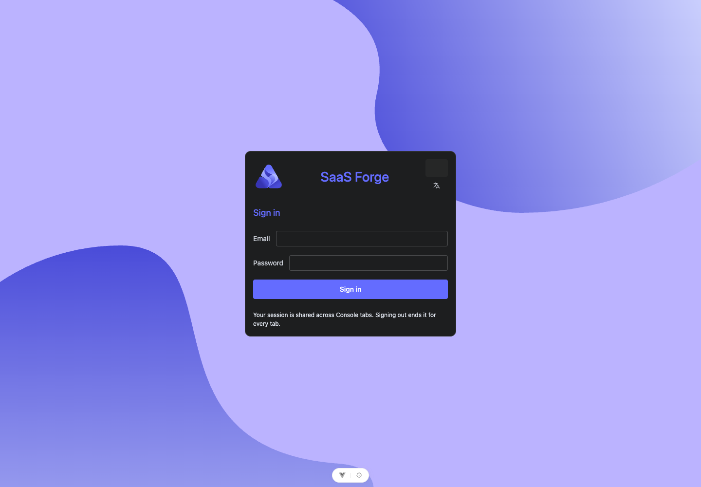

# #206 环境交接验收

2026-09-28：独立类型、Lint、216 项 Node 测试与生产构建通过。使用固定正式 Client 0.4.0（来源 ebff4b338d0c4b39e51488ac1e9b98885318d438）、外部 Playwright 1.62.1、真实桌面 Chrome 154.0.8037.57，通过已准备受信 HTTPS 环境验证登录、权威平台上下文选择、刷新、第二标签页与退出。

[原始脱敏浏览器结果](assets/issue-206/browser.json) 对应轮次 `aa8d11c9-513b-4782-94e2-7dc514fd86eb`，与后端 probe 按相同交接文件摘要关联；后端长期证据位于其 `docs/acceptance/assets/issue-206/`。该路径仅是交付记录，不构成前端构建/运行的相邻仓库依赖。

浏览器没有模拟成功 API 响应。Cookie 安全属性、真实 Gateway Origin、键盘登录、标题焦点、中英文与主题检查通过，未知页面/Console/API 错误为零。最初语言按钮定位器歧义导致一轮失败，修正后重跑；失败轮次未计为通过。截图只在填入凭据前采集。

这是普通已启动环境，非 Fresh；执行时前端基线 75a812ccbf14610cf4ff169d15ed648ed922b7d2、dirty=true。源工作区 SHA 不冒充已运行后端的部署制品身份。没有修改后端进程或数据，没有新增产品依赖；前端自行启动 Vite，浏览器入口使用已有 HTTPS Edge。操作方式与外部 Playwright 运行时要求见 [独立验证](../independent-verification.md)。

未执行真实 Fresh、#183–#189 聚合、Token/Redis 攻击与恢复、完整视觉像素回归/自动无障碍、业务主链及远端新提交 CI。当前截图仅供人工核对。未发布任何新制品，不以当前冒烟替代父 #201 或各业务票验收。

Spec 审查发现的前端版本归属问题已修复：Vite 在开发/生产 HTML 提供公开 sf-build 元数据，Chrome 在提交凭据前与执行目录的源码内容摘要、Git/lock 和 Client 来源核对。缺失标识的 red 实机轮次明确失败，补齐后完整流程通过；源码未暂存删除也有独立临时 Git 回归测试。
