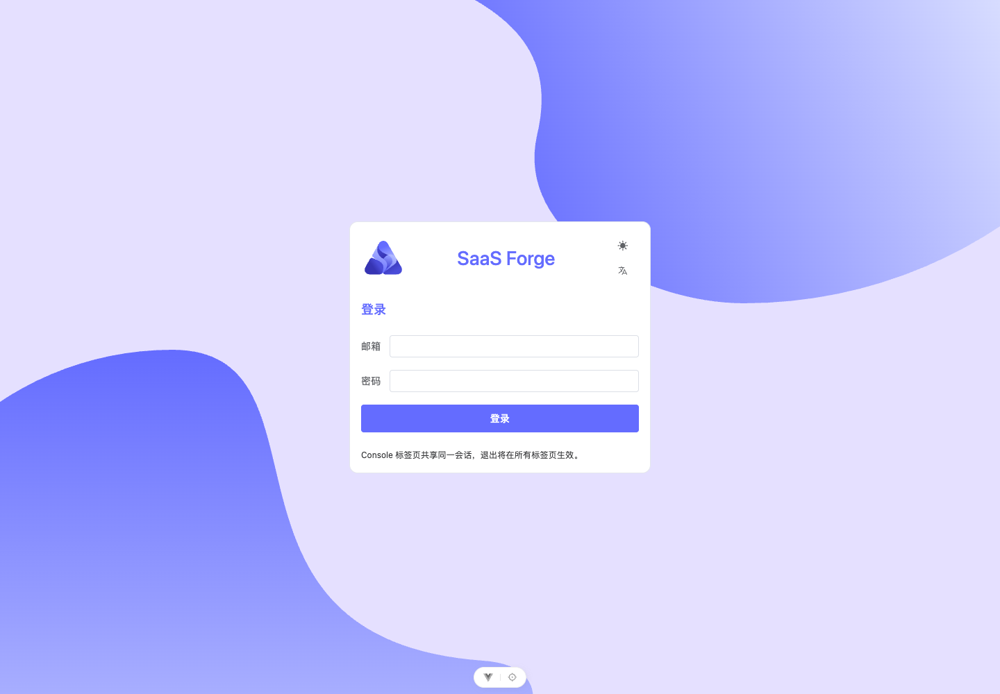

# #206 环境交接验收

2026-09-28：独立类型、Lint、216 项 Node 测试与生产构建通过。使用固定正式 Client 0.4.0（来源 ebff4b338d0c4b39e51488ac1e9b98885318d438）、外部 Playwright 1.62.1、真实桌面 Chrome 154.0.8037.57，通过已准备受信 HTTPS 环境验证登录、权威平台上下文选择、刷新、第二标签页与退出。

[原始脱敏浏览器结果](assets/issue-206/browser.json) 对应轮次 `aa8d11c9-513b-4782-94e2-7dc514fd86eb`，与后端 probe 按相同交接文件摘要关联；后端长期证据位于其 `docs/acceptance/assets/issue-206/`。该路径仅是交付记录，不构成前端构建/运行的相邻仓库依赖。

浏览器没有模拟成功 API 响应。Cookie 安全属性、真实 Gateway Origin、键盘登录、标题焦点、中英文与主题检查通过，未知页面/Console/API 错误为零。最初语言按钮定位器歧义导致一轮失败，修正后重跑；失败轮次未计为通过。截图只在填入凭据前采集。

这是普通已启动环境，非 Fresh；执行时前端基线 75a812ccbf14610cf4ff169d15ed648ed922b7d2、dirty=true。源工作区 SHA 不冒充已运行后端的部署制品身份。没有修改后端进程或数据，没有新增产品依赖；前端自行启动 Vite，浏览器入口使用已有 HTTPS Edge。操作方式与外部 Playwright 运行时要求见 [独立验证](../independent-verification.md)。

普通环境轮次未执行真实 Fresh（后续已补验如下）、#183–#189 聚合、Token/Redis 攻击与恢复、完整视觉像素回归/自动无障碍、业务主链及远端新提交 CI。当前截图仅供人工核对。未发布任何新制品，不以当前冒烟替代父 #201 或各业务票验收。

Spec 审查发现的前端版本归属问题已修复：Vite 在开发/生产 HTML 提供公开 sf-build 元数据，Chrome 在提交凭据前与执行目录的源码内容摘要、Git/lock 和 Client 来源核对。缺失标识的 red 实机轮次明确失败，补齐后完整流程通过；源码未暂存删除也有独立临时 Git 回归测试。

## 真实 Fresh 补验

用户授权后，后端环境准备方创建独立 Fresh 项目和专用凭据，前端仍只接收已准备交接。runId `3eba95e8-4e66-41df-b60e-9d636c8d9dab`；五服务实际镜像/容器、JDK 17、三类数据卷、网络与 Gateway 公钥由后端核验。正式入口先完成专用账号首次改密，再通过登录、权威平台上下文、刷新、第二标签页、退出与匿名恢复，未知页面/Console/API 错误为零。平台账号完成显式平台上下文选择，原始记录包含 context-selections 204；本轮不声称覆盖双身份矩阵。

[Fresh 浏览器原始结果](assets/issue-206/fresh/browser.json) 记录前端 `c06c1e2`、dirty=true（截图等待修正和证据整理）、实际 HTML 来源核对、Client 0.4.0 与 lock 摘要；后端来源 `7393d98`、dirty=true，实际镜像 ID 位于后端持久交接记录。两份报告通过同轮交接 SHA-256 关联。最终再次执行前端完整 verify，通过 216 项测试、类型、Lint 与构建。

首次 Fresh 匿名会话因后端受控开关未开启而失败，环境方按既有协议切换说明启用专用空环境并重建后重跑；失败轮次不计通过。截图仅在填写凭据前采集，增加图标与进度结束等待；不声称完整视觉像素或无障碍验收。环境保留供查看，前端没有销毁后端数据或恢复旧进程。所有未迁业务及专项覆盖保持原归属。
